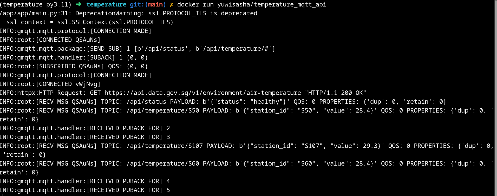

## How to launch

### Build

```
git clone https://github.com/yuwisasha/temperature_mqtt_api.git
```
```
docker build . -t temperature_mqtt_api
```
```
docker run temperature_mqtt_api
```

### Using docker image

```
docker pull yuwisasha/temperature_mqtt_api
```
```
docker run yuwisasha/temperature_mqtt_api
```

### Stop container

**Ctrl+C** - KeyboardInterrupt

## Example

